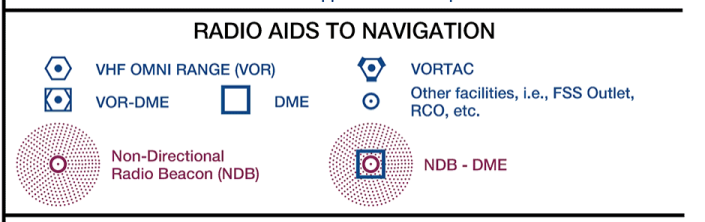
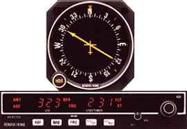
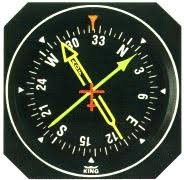
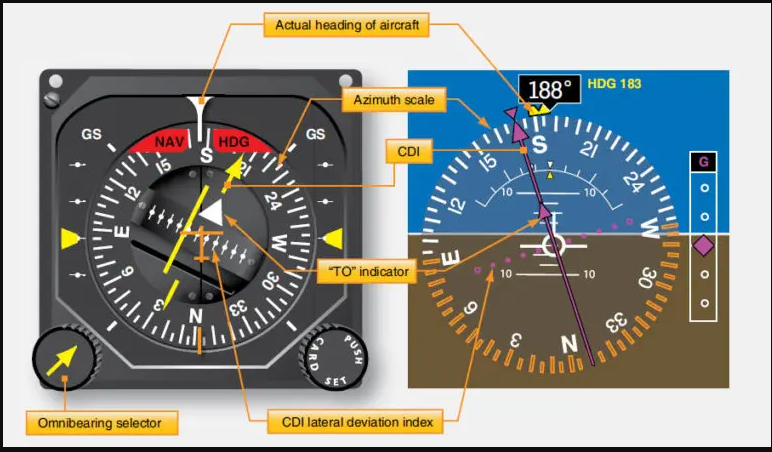
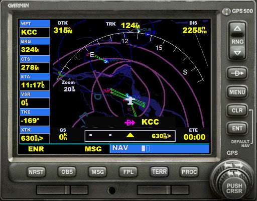

# Navigation Flight

### Maps and planning our flight

*The flightsim community is large and very active! Below you will find some great tools. For the purpose of this introduction I only list free add-ons and tools. The list is not comprehensive by any means :-)*    

#### Online tools

- SkyVector
> [SkyVector is a great online flight planning map](https://skyvector.com/?ll=53.225277778,5.7525&chart=302&zoom=3)   
> and is used for real flight planning as well as by many flightsimmers!   
> use the [**World VFR**] tab initially   
- Online flightsim sites: 
> [A good source of IFR charts is Dutch VACC](https://www.dutchvacc.nl/charts/)   
- Gemini **FreeAirMap** is a free moving map for practically all flightsims. You need to be online because it downloads its content *on the fly* (pun intended). You have to download and intall it first. It can be found here:   
> [geminisoftware.de](http://www.geminisoftware.de/) {You may get a warning, since it is not a SSH / https:  site}   
> Gemini can be incorporated into your P3D cockpit nicely, if you want   

- krepelka.com  (website about FSX flying)   
[krepelka.com source of information on navigation](http://krepelka.com/fsweb/learningcenter/navigation/navigationindex.htm)   

#### Offline tools

- Little Navmap can be downloaded and installed for differents sims, we'll choose the P3D version of course..
> [Little Navmap github here ](https://albar965.github.io/index.html)   
> .. and is a great tool that helps plan and follow (moving map) our flight.
> Even in multiplayer we'll be able to see the other co-player and AI aircraft.   

### *RADIO* Navigation

Since terrain features are not very well represented in the sim we will use Radio Navigation to help us orient and find our way in the virtual world.   
Before the emergence of Satellite Navigation (GNSS / GPS) aviators relied on their No.1 Eyeball for landmarks or AM broadcasting stations that sent out Morse code identification, so you could be sure you were flying to the proper station.
Knowing the basics of Radio Navigation will also help if we encounter IFR (instrument Flight Rules) weather conditions.   
**Note**: Flying IFR also requires that we are proficient flying the aircraft solely on instruments.   

[VFR Sectional chart legend](sect_legend.md)   

For the 2nd flight I will use an annotated Skyvector VFR (Sectional) map to show where we'll go and which help we can get from the airborne and ground based equipment.

  

#### NDB and ADF

The oldest (pre WW2) NAV radio beacons are the Non Directional Beacons (NDB). They consist of AM frequency radio stations. If you tune the station in your ADF (Automatic Direction Finder) radio - and you are within reach - the ADF needle should start to move. Find the ADF in your radio stack.  
 
     

In most older aircraft, *not in the Mooney we fly now (!)*, you'll find the **ADF** indicator, The arrow points to the tuned AM station. This could also be an AM music radio station, actually! To be sure the arrow is pointing correctly, we keep the broadcast Morse code signal audible in our headset.. For the purpose of this flight we'll disregard the NDB stations.

#### VOR

VOR stands for VHF Omni-Directional Range (or radio). In essence it sends out radio signals that represent radials. They can be compared to spokes on an old bicycle wheel. When tuned to a VOR station, you can follow one of those radials TO or FR (from) that radio station.   
To stay on a specific spoke, pilots use a CDI (course deviation indicator). In the left example below (a Horizontal Situation Indicator [**HSI**]) the needle shows that the aircraft is flying to the station (hence the TO), with the 205deg radial tuned in. The CDI shows that sthe radial lies to the left of the aircraft. Once the aircraft gets on the “spoke” or radial, the needle will be centered. *Since the TO flag is visible it is unlikely that the red NAV flag would be visible.* The right picture is an  example of a possible glass cockpit representation.   
   
In addition to flying to and from the VOR station on a particular radial, some stations have DME (Distance Measuring Equipment). So, in addition to knowing you are flying to or from the station on a particular radial, you also know how many miles away from the station you are.

#### LOC and ILS

### Other means of navigation

#### INS

   
**INS** or Inertial Navigation Systems are in use since the beginning of WW2 and installed in military and civilian aircaft. They are installed as stand alone equipment and / or as part of a sophisticated IRS platform that integrates Radio, Inertial and GPS positions to a very accurate position (usually in LAT/LON). Explanation and use for our flights is beyond the scope of this guide.

#### GPS
   
We are all familiar with GPS navigation. The 'standard' P3D GPS is modelled after the GARMIN(R) GPS 500. It needs getting 'used-to'. For our first few flights we'll not bother with is. But if you want to use it on later flights I recommend you read **krepelka.com**s excellent explanations. See for the GPS below:   
[Detailed description of the Garmin GPS 500](http://krepelka.com/fsweb/learningcenter/navigation/usingthegps.htm)   

