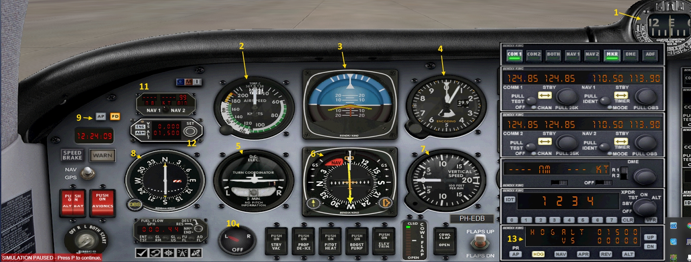

# Mooney Bravo cockpit layout

We see the following cockpit instruments:   
1. Magnetic Compass   
2. Airspeed Indicator   
3. Artificial Horizon   
4. Altimeter (altitude in feet, setting in Inches (US) or Millibars)   
5. Turn co-ordinator    
6. Horizontal Situation Indicator (HSI), which contains     
    <small> **- Heading indicator (gyro)  
    - Heading bug, can be set with orange knob   
    - Course selector, yellow (arrow) knob, also called Omni Bearing Selector (OBS)   
    - Course deviation indication   
    - NAV flag**</small>   
7. Vertical Speed Indicator (VSI), indicates your climb or descent -speed in ft/min   
8. VOR (NAV) with its own OBS and TO / FROM flag   
9. Autopilot [AP] and Flight Director [FD] toggle switches   
10. Fuel tank selection indication / switch   
11. Distance Measuring Equipment (DME) indicator   
12. Autopilot Altitude settings for altitude and vertical speed select   
13. Autopilot panel with mode selections for    
<small> **- [AP] on / off   
- [HDG] (pre)select   
- [NAV] (pre)select   
- [APR] approach (pre)select   
- [REV] reverse localizer approach (pre)select   
- [ALT] altitude (pre)select    
- Vertical speed [UP] or [DN]   **</small>      

> **All the other switches are marked respectively..**   

