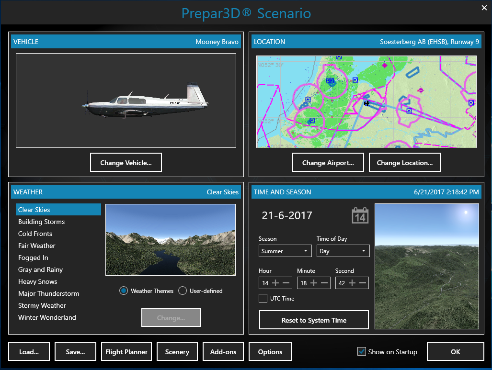
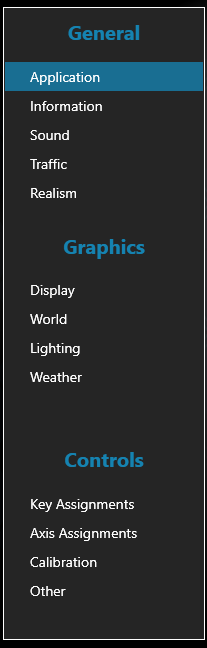

## P3D Configuration 
After installation and activation we will see the following initial screen.

### Initial screen

   
We can choose our favorite aircraft with **Change Vehicle** and **Change Airport** of departure. Here we can choose between *Active Runway* or another specific runway or parking area.   

And we can set **WEATHER** and **TIME** of day **AND SEASON** of our choice.

We will discuss the **OPTIONS** menu later in this handbook. For now here are the recommended settings.

### OPTIONS 

> Under **General > Application** we want to uncheck **[ ] pause on task switch**

> **Realism** we set to **Easy**

> Under **Controls** > **Calibration** we find our joystick controller. We leave the settings for now.   
<small>Maybe we want to check **[ ] Use Simple Control**</small>

> **[ OK ]** We confirm our choices  

<b><i>Let's embark on our first flight!</i></b>

