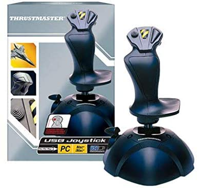

# Practical P3D Flight Handbook

## Introduction

PC based flight simulation is a rewarding pastime, but can also be rather overwhelming. Which software to choose? Which add-ons to buy (BTW: some of the best are free!). Where do I start?
The purpose of this P3D handbook is to be a comprehensive guide to get started. Lockheed Martin Prepar3D (P3D v4) is the subject of this handbook, but it will help with other PC flight-sims as well. So just follow along!   
> Although not all *steam gauge* trained pilots may agree, I believe that the transition from *old school* flying and instrumentation to the new automated *glass cockpit* aircraft is easier than vice versa. So we'll start with an aircraft with typical non-digital instruments for our introduction to *flight simming*.   

## Equipment and accessory software

Things we will need for a basic setup are:

### Hardware

  - PC or laptop (64bit) with Windows 10

  - Keyboard and mouse

  - Decent monitor

  - Joystick (usb), preferably with throttle handle and rotation (yaw / z-axis) option; e.g. like these:

    |  |  |
    | :---------------------------------------------------------: | :---------------------------------------------------------: |
    | Thrustmaster usb PC Joystick                                 | Logitech G Extreme  3D Pro Precision Flight Stick       |

  - [Detailed info on joysticks here](https://en.wikipedia.org/wiki/Joystick)   

### Software

  - P3D v4.x installation   
    This guide may also be valuable with other PC based flight-simulator software like:   
    - Microsoft Flight Simulator X (FSX, FSX Steam edition).    
    <small>**NOTE:** FSX is 32 bit software, which tends to surprise you with Windows Memory Overflow errors. Usually precisely on final approach after a long flight!</small>    
    - X-Plane 11     
    - Microsoft Flight Simulator MSFS 2020   
  but will refer to **Lockheed Martin Prepar3D (P3D) version 4.5** for its examples   

We'll also be looking at (free!) additional tools, like cool extra aircraft, scenery, maps, websites and flight planning software.
   

## Installing the software

To install your copy of P3D you will need a download location, a **License ID** and an **License Activation Password**.

> **Download** [P3D purchased downloads](https://www.prepar3d.com/purchased_downloads/)

After installation P3D will ask for your License ID and License Activation Password, to authorize use.   
You will need to be on-line for this. By the way: installation and every start-up will take some time, because P3D needs to load the various aircraft models and scenery files.
Make sure your hardware is connected and configured, before you start-up P3D.

  