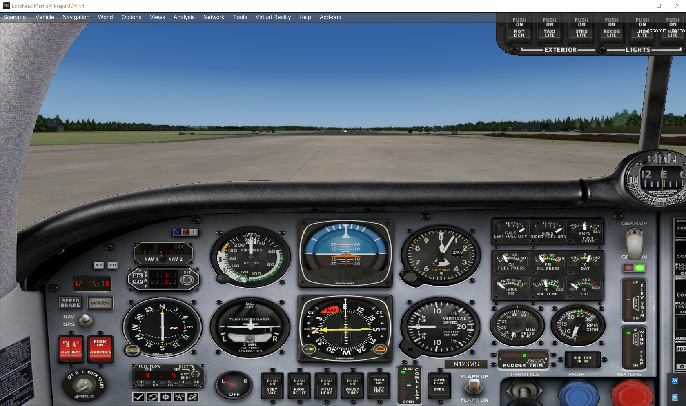
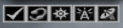
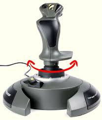

# Instruction Flight 1
** Basic First Flight **

For good measure, here is the Briefing again:

#### Briefing

> *The <u>goal</u> of this flight is to get familiarized with P3D and flying a VFR flight. We will perform a take-off, get used to the controls and take in the views. Then we'll return to Soesterberg.  
> <u>Standard Safety and Emergency Procedures</u> apply.    
<u>WX</u>: The weather is fine so there are no restrictions today. It is **CAVOK** as they say: Ceiling and Visibilty OK or '*Clear Skies*' in P3D terms.*   

1. <u>TYPE</u>: We will be making a <b><i>VFR</i></b> (Visual Flight Rules) flight.
2. <u>AC ID / PIC</u>: You will be <b><i>PIC</i></b> (Pilot in Command) in a <b><i>Mooney Bravo</i></b> or <b><i>Mooney Bravo Retro</i></b>.     
3. <u>DEP</u>: Departure airport is Soesterberg Airbase (ICAO: **EHSB**).     
4. <u>ROUTE</u>: It will be a *local* flight, so the
5. <u>DEST</u>: Destination is also **EHSB**. 
6. <u>ALTITUDE(s)</u>: Flight altitude will be between 500 and 2000 feet.
7. <u>ETD</u> (Estimated Time of Departure): Departure time will be around noon (12:00h LT)
8. <u>ETE</u> (Est'd Time Enroute): The flight will be 00:20' long appx.   
     
---

[Overview map of 1st Flight](EHSB-01.md)   

- to reiterate: we have checked the aircraft and required documentation during the **PREFLIGHT**

#### Aircraft Familiarization   
-  **Our simulator has the important advantage of a pause switch [**P**]! Use it whenever you want!**   
- in P3D we enter with the engines running, so we just sit down and make ourselves comfortable. If somehow the engine is **not** running we type **[Ctrl+E]**   
- in [**P**]ause you will not hear the engines! Neither will you hear the sim when you have pressed the [**Q**]uiet key...   
- look around: [S] to change the main **S**creen <u>view</u>; [A] **A**lternates between different cockpit or outside <u>views</u>.   
    - you can also use the joystick [Hat] switch to rotate the view / camera     
- We want to use the 2D cockpit view for now, which can also be set by typing [Shift+1]   
<small>The Mooney has a nice 2D cockpit panel that includes all the necessary instruments, gauges and switches.</small>   

> [Shift+1] toggles between 2D / 'Wide' view   
> [Shift+2] toggles the radio-stack   
> [Shift+3] toggles the GPS panel   
> [Shift+4] shows the Annunciator Panel   
> [Shift+5] shows the Overhead switch panel   

> NB! this configuration only applies to this specific model, but most aircraft have comparable panels that can be shown with the combination [Shift 1 thru 9].   
> additionally we can look at the map or access the Air Traffic Control (ATC) interaction panel. See the icons below   
>      
> from left to right:   
        > checklist ('kneeboard', often empty, depending on model)   
        > ATC panel   
        > Map (you can also *map the [m] key to map*); on later flights we'll use other, better :-) tools      
        > Radio stack   
        > GPS  

#### Taxi

- Depending on where we are, we need to find our way to runway (RWY) 09    
- Release the brakes:   
    - [ . ] touches the brakes   
    - [Ctrl + .] toggles the Parking Brake   
    - in standard set-ups the trigger on your joystick touches the brakes as well  
- taxi to RWY 09, power 1000 rpm, you can steer with the rudder pedals, with standard joysticks this can be done by rotating the joystick, if you are not lucky enough to have actual rudder pedals installed      
    -   
-  Flaps and trim set for T/O (Mooney: flaps 10 (1st detent), T/O trim)    
- **NB!** before entering the runway (rwy) we *hold short* and **check** if all is clear, we don't want to enter the rwy while another aircraft is on final approach!!   
- Pitot heat on, Strobelights on, Landing lights on, Transponder (TX) Altitude reporting / mode S [ALT] on    

#### Takeoff (T/O)

- line up and check the rwy heading (Compass or Heading Indicator)   
- HDG bug on rwy HDG   
- Stay on the brakes and gradually add power (Throttle increase)   
- Release brakes and remain on rwy centerline with rudder   
- Check full T/O power
- Approaching appx. 65 KIAS (Knots Indicated Airspeed; knots are NM: Nautical Miles / hr) the acft will want to fly
- Gently set the Attitude at 5deg nose up
- remain rwy TRK (in no wind conditions same as rwy HDG) and climb to 500ft  
- Gear up [**G**] when climb is confirmed    

#### Climb (CLB)

- while climbing make a gentle turn to HDG 290 deg   
- keep climbing with CLB PWR (2400 rpm / 34" MP {manifold pressure}) to 1500ft   
- reaching 1500ft reduce PWR and maintain 1500ft / 140kt

#### Cruise (CRZ)   

- For this short flight we'll stay relatively low at 1500ft   
- CRZ power: adjust rpm so airspeed remains between 120 - 160 KIAS   
- on HDG 290deg we should see EHHV (Hilversum arpt) appear, after e few minutes   
    - You could check the Map for orientation   
- overhead EHHV we start a gentle (left) turn southward
- while turning on course back to EHSB we start a descent   

#### Descent   

- set rpm to 2000 rpm; MP below 34"   
- descent to 500ft AGL (Above Ground Level) minimum  
- appx. 150 KIAS    
- find EHSB rwy 09 and turn toward it   
    - preferably line up: i.e. fly towards rwy 09 with a HDG of 090 deg   

#### Approach (APP)   

- slow down to below 110 KIAS   
- extend flaps to 10 deg; reduce to 90 KIAS
- extending gear [**G**] (140 KIAS or below!) helps slowing down   
- line up on rwy 09 centerline   

#### Landing (LDG)   

- final APP speed 75 KIAS   
- select full flaps (switch or [**F8**])   
- propellor (blue) and mixture (red) levers full forward   
- power and trim settings to maintain final APP speed   
- aim for a point beyond the rwy threshold   
    - Select a point past the runway threshold and aim for it. Adjust your pitch so that the point remains stationary in your view out the windscreen. Leave the power at your final approach setting, and fly the airplane down to the runway. Reduce power to idle just before flaring and touch down.   
- after touch down reduce power to idle (or [**F1**])
- apply brakes, exit the rwy   
- retract flaps
- taxi to parking   
___
**Mooney flight fases description details**:  
[For a more detailed description check here](http://krepelka.com/fsweb/learningcenter/aircraft/flightnotesmooneybravo.htm)   

